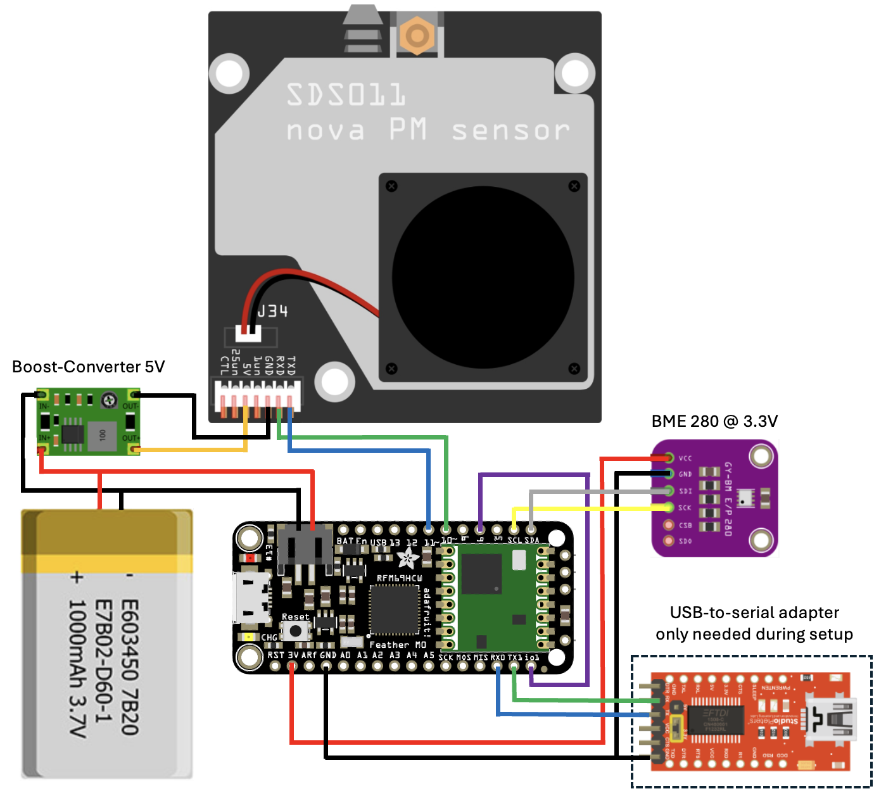

# Battery-powered LoRaWAN particulate matter sensor

## Motivation

Battery-powered replacement for the famous [airrohr](https://sensor.community/en/sensors/airrohr/)
by the sensor.community (formerly known as luftdaten.info). Please note that this sensor cannot
transmit the PM readings to a public sensor network (e.g. [sensor.community](https://sensor.community/)
or [openSenseMap](https://sensebox.de/en/opensensemap)) on its own, since it doesn't have a WiFi uplink.
You need to deploy you own software to retrieve the senosr data from your LoRaWAN provider
(e.g. [TTN](https://www.thethingsnetwork.org/)) and forward it to public database.

## Features

- measures particulate matter (PM 2.5 and PM 10), humidity and temperature
- sensor readings are transmitted at preset intervals (e.g. every 10 minutes) using LoRaWAN
- the SDS011 sensor is powered up for 20 seconds before reading the measured values (~120 mA)
- Feather M0 and SDS011 sleep inbetween sensor readings to save power (~5 mA)
- supports BME280, Si7032 and SHT31 as temperature/humidity sensor
- battery-powered (airrohr needs 5V USB power supply)

## Hardware components (total costs about 75€)

- [Adafruit Feather M0 with RFM95 LoRa Radio](https://learn.adafruit.com/adafruit-feather-m0-radio-with-lora-radio-module/overview) (~35€)
- Nova Fitness SDS011 Fine Dust Sensor (~25€)
- I2C temperature/humidity/pressure sensor [BME 280](https://www.bosch-sensortec.com/products/environmental-sensors/humidity-sensors-bme280/) (breakout board 3.3V, ~5€)
- Boost-Converter 5V (~200mA, ~2€)
- 3.7V Lithium Polymer or Lithium Ion battery (>2000mAh) with JST jack (~ 8€)
- flexible tube, diameter 6 mm, length approx. 20cm (aquarium shop)
- weather protection, Marley Silent HT Arc DN 75 87° (see assembly instructions for [airrohr](https://sensor.community/en/sensors/airrohr/))

## Schematics

 

## Upload firmware

To compile the firmware for the Feather M0 LoRa module just download [Visual
Studio Code](https://code.visualstudio.com/) and install the [PlatformIO
add-on](https://platformio.org/install/ide?install=vscode). Open the project
directory and adjust the settings in `include/config.h` to your needs (set
LoRaWAN DevEUI, JoinEUI and AppKey).

You need to remove or comment out the `os_getBattLevel()` function at line 122
in the file `src/lmic/lmic.c` of the MCCI LoRaWAN LMIC Library to avoid a linker
error about `multiple definitions` of this function call.

Please note that Serial1 (RX0/TX1 pins of the Feather M0 board) is used
for serial message output since the Feather's USB port has issues after
the M0 chip has been put to sleep state. You will need to connect a
USB-to-serial adapter during setup to view the log messages.

## Contributing

Pull requests are welcome! For major changes, please open an issue first
to discuss what you would like to change.

## License

Copyright (c) 2024 Lars Wessels  
This software was published under the Apache License 2.0.  
Please check the [license file](LICENSE).
